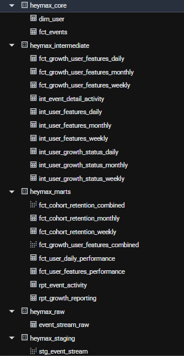

# Heymax — dbt Analytics Project

A compact, production-minded **dbt project** that transforms event data into analytical datasets for growth, engagement, and retention analysis. The project simulates a **production-ready data transformation pipeline**.

The implementation highlights key analytics engineering practices:

- **Layered** warehouse modeling built on BigQuery
- **Reusable** dbt macros
- Incremental pipelines with backfill capability
- **Daily refresh** orchestration
- Data quality **testing**
- **BI dashboard** with analytics insights  

---

# 🏗️ Warehouse Architecture Overview

The warehouse follows a **layered dbt architecture** to ensure scalability, modularity, and maintainability.

BigQuery Project screenshot 




## Design Principles

✨ Separation of concerns  
✨ Reusable transformations  
✨ Scalable metric modeling  
✨ Maintainable SQL code  

### 🧹 Staging

**Purpose**

- Clean RAW SOURCE `event_stream_raw`
- Standardize column names and data types
- Apply minimal transformations

**Materialization**  
`view`

---

### 📦 Core

**Purpose**

Define canonical business entities.

Examples:

- `fct_events`
- `dim_user`

---

### ⚙️ Intermediate

Reusable transformations for user activity metrics.

Typical logic includes:

- user activity aggregation
- cohort preparation
- growth classification

---

### 📊 Marts

**Purpose**

Business-facing analytical datasets used by BI, product, and growth analytics.


---

# 🧠 dbt Macros

Macros are used extensively to reduce duplicated SQL and improve maintainability.

## Period Generation Macro

A macro generates **daily, weekly, and monthly models** from a single template.  
This allows the same transformation logic to be reused across multiple time grains.

Example macro:  
https://github.com/linyahh/dbt_project/blob/dev_linya/heymax_case/macros/generate_cohort_retention.sql

Example usage:

```
{{ generate_cohort_retention('week') }}
{{ generate_cohort_retention('month') }}
```

---

## General Aggregation Macro

A reusable aggregation macro enables flexible reporting queries.  
The macro automatically builds grouped aggregations and supports multiple dimension combinations.

Example macro:  
https://github.com/linyahh/dbt_project/blob/dev_linya/heymax_case/macros/generate_growth_reporting_aggregation.sql

Example model using the macro:  
https://github.com/linyahh/dbt_project/blob/dev_linya/heymax_case/models/marts/growth/rpt_growth_reporting.sql

Users can dynamically specify:

- dimension combinations
- default dimensions
- aggregation metrics

---

# ⚡ Incremental Processing & Daily Pipeline

- `fct_events` is materialized as an **incremental model** partitioned by `event_date`
- Uses a **merge-based incremental strategy** to process only newly ingested events during scheduled runs, improving efficiency and reducing warehouse compute
- Models that require regular updates are tagged with `refresh_daily`

The daily pipeline is executed using:

```
dbt build --select tag:refresh_daily
```

**Execution flow**

incremental fact refresh  
→ intermediate transformations  
→ mart updates  
→ reporting tables

Historical backfills are supported using runtime variables:

```
dbt run --vars '{"backfill_start_date": "2024-01-01"}'
```

This rebuilds data from a specific date **without performing a full refresh**, supporting recovery from logic updates or late-arriving data.

---

# ✅ Data Quality Testing

Basic data quality assertions are implemented using **dbt tests**.

## Not Null Tests

Ensures required fields are always present:

- `event_key`
- `user_id`
- `event_ts`

## Uniqueness Tests

Ensures primary keys are unique:

- `dim_user.user_id`
- `fct_events.event_key`

## Relationship Tests

Ensures referential integrity between tables:

`fct_events.user_id → dim_user.user_id`

This prevents orphan records and enforces warehouse consistency.

---

# 🚀 BI Reporting

Dashboard:  
https://lookerstudio.google.com/reporting/186ec3f9-e82f-4016-b9c0-d3c40b70f1da

## Analytics Insights

### User Retention

- Monthly cohort retention declines sharply over time, dropping to **40%, 30%, 17%, and 3%** in months 1–4 after acquisition.
- For cohorts acquired during campaign weeks (Mar 30, Apr 27, Jun 1) across **Facebook, Google, and referral channels**, retention drops significantly **after week 4–5**, suggesting many newly acquired users disengage shortly after the initial campaign-driven activity period.

### Miles Earning and Redemption Behavior

- **Shopping contributes 65%** of miles earned, followed by **dining (25%)** and **e-commerce (10%)**
- The overall **miles redemption rate is ~80%**, indicating strong engagement with the rewards program
- Among redeemed miles, **75% are used for flights** and **25% for hotels**, suggesting flights are the dominant redemption preference

---

# ▶️ How to Run the Project

## 1. Environment Setup

- Configure a **BigQuery project and dataset**
- Ensure the correct **location and project settings** are defined in `profiles.yml`
- Navigate to the project root directory

## 2. Install Dependencies

Install dbt packages defined in `packages.yml`

```
dbt deps
```

## 3. Run the Full Pipeline

Build all models and run tests

```
dbt build
```

## 4. Run Daily Refresh Models Only

```
dbt build --select tag:refresh_daily
```

## 5. Run Data Quality Tests

```
dbt test
```
